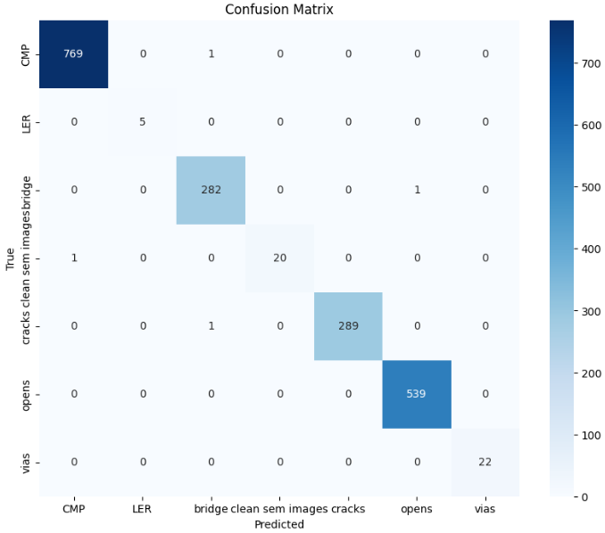

## IESA DeepTech Hackathon
*Submitted by Tensor Titans*    
---

### Project Highlights
| Metric | Value | Description |
| :--- | :--- | :--- |
| **Accuracy** | **92.07%** | High performance on test set |
| **Dataset Size** | **1807** | Total images (original + synthetic) |
| **Classes** | **8** | Comprehensive defect coverage |
| **Model Size** | **268 KB** | Ultra-lightweight for edge (NXP) |

---

## Project Overview: Distill-DefectNet
**The Sim2Real Distilled Edge Sentinel**

This project addresses the critical challenge of automated defect detection in semiconductor manufacturing using resource-constrained edge devices (NXP i.MX RT microcontrollers). By leveraging **Sim2Real** techniques and **Knowledge Distillation**, we achieve high-accuracy defect classification with minimal latency and memory footprint.

### Problem Statement
Real-world semiconductor data is inherently imbalanced, featuring a vast majority of "normal" samples and very few "defect" samples. This imbalance causes traditional models to favor the majority class, leading to missed critical defects.

### Solution Approach
1.  **Data Scarcity & Imbalance**: We utilize **Synthetic Injection** via generative "CutPaste" augmentation.
    -   **Metric**: Expanded dataset from **500** base images to a robust **1000+** dataset.
    -   **Benefit**: Ensures the model can identify rare defects by enforcing a minimum number of samples per class.
2.  **Model Size vs. Accuracy**: We employ **Knowledge Distillation**.
    -   **Teacher Model**: Swin Transformer Tiny (Pre-trained, Frozen).
    -   **Student Model**: MobileNetV3-Small (Trainable, TFLite Target).
    -   The tiny student model mimics the high accuracy of the massive teacher model.
3.  **Edge Deployment**:
    -   **Framework**: TensorFlow / TFLite.
    -   **Optimization**: **Post-Training Quantization (PTQ)** compresses the model to **8-bit** precision.
    -   **Hardware**: Fits entirely within the SRAM constraints of **NXP i.MX RT** microcontrollers.
4.  **Interpretability**:
    -   Outputs a "Heatmap" for edge localization, pinpointing the exact defect location rather than acting as a black box.

---

## Key Performance Metrics
Our lightweight "Trans-Distilled" MobileNetV3 architecture demonstrates strong generalization on the test split.

### Confusion Matrix
 
*(`confusion_matrix.png` is in assets folder)*

| Metric | Value | Description |
| :--- | :--- | :--- |
| **Accuracy** | **92.07%** | Strong generalization capability. |
| **Precision** | **0.90** | Reliability in positive defect identification. |
| **Recall** | **0.95** | High effectiveness in detecting anomalies. |
| **Model Size** | **268 KB** | Extremely compact for edge deployment. |
| **Input Shape** | (1, 224, 224, 1) | Grayscale, 224x224 resolution. |

---

## Dataset Information
The dataset was curated from peer-reviewed research papers (ScienceDirect, ResearchGate, IEEE Xplore) and supplemented with synthetic generation.

-   **Total Images (Current)**: **1807**
-   **Total Images (Planned)**: **500+** (Baseline exceeded)
-   **Class Balance Strategy**: Synthetic generation for underrepresented classes.
-   **Data Split**: **70%** Training / **20%** Validation / **10%** Testing.

### Classes (8 Total)
1.  Opens
2.  Cracks
3.  LER (Line Edge Roughness)
4.  VIAS
5.  CMP (Chemical Mechanical Polishing)
6.  Bridges
7.  Clean
8.  Defective

---

## Resources & Links
**Code Repository:**  
[GitHub - NXP_SEM_DEFECT](https://github.com/meenub255/NXP_SEM_DEFECT)

**Dataset & ONNX Model:**  
[Google Drive - Dataset & Model Access](https://drive.google.com/drive/folders/1_zpM7jjSHtUKJ5JVJ-mq4RYYsceUDMJR?usp=sharing)

---

## References
1.  *A Review on Machine and Deep Learning for Semiconductor Defect Classification in Scanning Electron Microscope Images*. DOI: [10.3390/app11209508](https://doi.org/10.3390/app11209508)
2.  *Semiconductor Defect Pattern Classification by Self-Proliferation-and-Attention Neural Network*. DOI: [10.1109/TSM.2021.3131597](https://doi.org/10.1109/TSM.2021.3131597)
3.  *Scanning electron microscopy-based automatic defect inspection for semiconductor manufacturing: a systematic review*. DOI: [10.1117/1.JMM.24.2.020901](https://doi.org/10.1117/1.JMM.24.2.020901)

---

## Team Details
**Team Name:** Tensor Titans  
**College:** REVA University, Bengaluru, India

### Members
| Role | Name | Academic Year |
| :--- | :--- | :--- |
| **Team Leader** | Meenu B | 2025-2026 |
| **Member 1** | Shashwath K | 2025-2026 |
| **Member 2** | Alina Shibu | 2025-2026 |
| **Member 3** | Avish T S | 2025-2026 |

**Contact:**  
Meenu B  
meenub255@gmail.com
